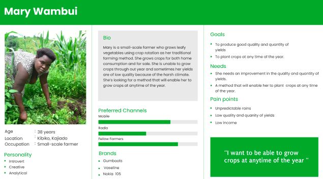

Utilizing technology to improve quality and quantity of yields 
# 
 LIMA SMART

 

Lima Smart is a smart farming project that intends to improve the quality and quantity of yields for Kenyan small-holder farmers while using smart irrigation.
## Product Speifics 
Authors : Juliet Gisemba , Caroline Njuguna , Yvonne Mnyazi , Intwaza Belyse and Mercy Birungi

Project name : Lima Smart

Project Status : Under Developement

Version number : 1.0

Version Description : The background , user stories , user flow goals and design interactions 

## Background
Agriculture in Kenya dominates Kenya's economy. Most of it is happening in the rural areas of the country and farmers depend on it as a source of income. However, climate change has greatly impacted farming in the country a great deal. Seasons are no longer predictable and farmers are left with no choice other than to figure out solutions to save the situation. Technology, being one of the solutions served to the farmers, is still in its baby steps despite numerous innovations being made day in and day out. According to research done in the past, the majority of tech innovations fail to succeed after being commercialized since the innovations either fail to solve the problems faced by the farmers, the farmer practice is equal to the innovation or the innovation is expensive. On the other hand, age and tech literacy greatly affect the adaptation of tech innovations by farmers. Most of these innovations are expensive for the farmers to switch to, not to mention their deeply rooted social norms. 

## Problem Statement

How might we increase the quality and quantity of yields for Kenyan farmers while utilizing technology despite the changing seasons?

## Objectives / goals of Lima Smart Project

The project aims to help the farmers by providing information about their agriculture fields. Monitoring environmental factors is the major factor to improve the yield of the crops. The feature of this project includes monitoring temperature, humidity and moisture in agricultural field through sensors DHT11, soil moisture using a a Soil Moisture Sensor (LM393) and the water level using a Water Level Sensor (FSW-6 Float Switch)
 Farmers will be provided with  prompts in form of SMS about what happens in the farm using a sim module .

## Reason for buiding a Smart Irrigation System

From the research we carries out , we noticed the diffrent challenges small scale farmers in Kenya were facing and this is specificaly those in Kajiado county . Most of the farmers face a challenge of change in cliamtic seasons , failure to detect the right amount of water for the crops and pests and diseases .

## User Personas

Persona 1

Persona 2

Persona 3

## User flow 

## Project time line 

<table> 
<tr>
<th>Month</th>
<th> Week </th>
<th> Deliverables</th>

</tr>
<tr>
<td>September</td>
<td> 
Week1 

   
27th - 1st Oct 

<td>
<ul>
<li>Submit the Work Plan </li>
<li>Final presentation outlay </li>
<li>Identify the requirements needed (dashboard, equipment) </li>
<li> Identify 2 plants and their profiles. </li>
<li> Farm setup </li>

<ul>
</td>
</tr>

<tr>
<td>October</td>
<td> 
Week2 

   
4th -  8th 

<td>
<ul>
<li>Code. </li>
<li>Create a Bill of Materials </li>
<li>Code Testing</li>
<ul>
</td>
</tr>

<tr>
<td>October</td>
<td> 
Week3 

   
11th - 15th

<td>
<ul>

<li>Sketch the control unit</li>
<li>Obtain 3D cards from GrabCad</li>

<ul>
</td>
</tr>

<tr>
<td>October</td>
<td> 
Week 4

   
18th - 22nd

<td>
<ul>
<li>Start planting(traditional and smart farming) </li>
<li>Find the type of documents to be used  </li>

<ul>
</td>
</tr>

<tr>
<td>October</td>
<td> 
Week 5

   
25th - 29th

<td>
<ul>
<li>Send data via SMS module.</li>
<li>Fetch and visualize data</li>
</ul>
</td>
</tr>

<tr>
<td>November</td>
<td> 
Week 6

   
1st - 5th

<td>
<ul>
<li>Maintenance</li>
<li>Fetch and visualize data</li>

</ul>
</td>
</tr>

<tr>
<td>November</td>
<td> 
Week 7

   
4th - 11
 </td>

<td>
<ul>
<li>Maintenance</li>
<li>Finalize and test</li>
</ul>
</td>
</tr>
</table>

    
